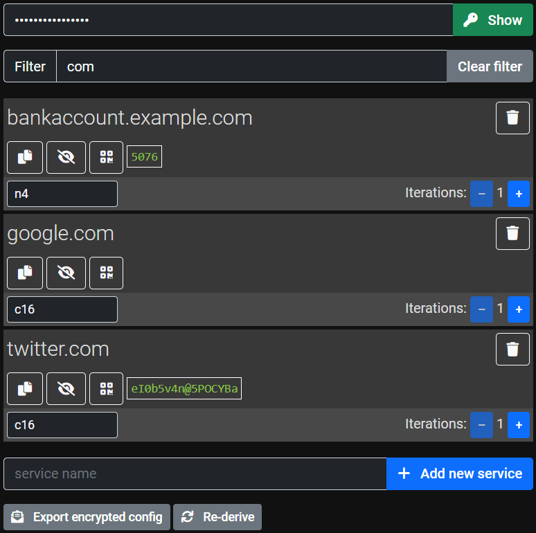

# m41nk3y Password Manager

m41nk3y is a password manager generating reproducible random passwords for your services such as online accounts. It
employs [PBKDF2](https://en.wikipedia.org/wiki/PBKDF2) and a user-specific configuration containing a list of service
names with an iteration count and a password pattern each.

## Advantages

* The m41nk3y application and your configuration file may be hosted publicly. Thus, they can be made accessible due to
  the possibility of replication.
* Key management can be performed completely offline. Your main secret does not need to be transferred over the
  network.
* Service passwords are random, which prevents dictionary attacks.
* You only have to memorize one main secret and no service passwords.
* No secret information is stored (in contrast to password safes).
* Having one or more service passwords compromised, an attacker cannot access or effectively guess other service
  passwords.
* Service passwords can be changed easily by changing the iterations count for the corresponding service name in case of
  compromising or proactively changing. Passwords with consecutive iteration counts cannot be guessed effectively.
* The built-in JavaScript crypto libraries are used to handle keys having an export prevention of secrets.
* The service configuration file is encrypted. One can only estimate the number of services included by the file size.
* Processing is done within the Web browser as a standard application platform.
* Password patterns fit to most service password requirements on length and character sets.
* The application can be used offline as soon as the network resources are cached. It uses the Progressive Web
  Application (PWA) model employing a service worker.

## Disadvantages

* With the m41nk3y application and the configuration file being public, the technology is vulnerable to offline brute
  force and dictionary attacks on your main secret. Of course, your option is to keep the configuration secret.
* With your main secret compromised, all service passwords can be derived, assuming the attacker has access to your
  configuration file or guesses your service names, the pattern and the correct iteration count.
* When changing your main secret, all service passwords change as well.

# Features

## UI Features

* derive service keys
* change config for registered services (pattern and iterations)
* export encrypted config to file
* import encrypted config from file
* add new service
* remove existing service
* filter service list by service name
* show secrets loading time

## Transfer Config to New Main Key

ATTENTION: All service keys are changed!

* (optional) load existing config with old main key
* input new main key
* export encrypted config and set as active config
* reload application and use with new main key

## Feature Wishlist

* create CI pipeline to serve Web app as Docker container with custom config as volume
* display software version and config version
* clean up functionality code and build classes, move add and remove away from Config class
* smarter configuration file saving, upload, share, cloud store

# Example Configuration

The service configuration is a JSON array. Each element of this array is a JSON object with the following structure:
`{name:"SERVICENAME", iterations: 1, pattern: "c16"}`

For each service, the service name should identify a service with a domain. The iteration offset count starts at 1. It
may be incremented in case of a compromised service key. The pattern is one of the values of `Patterns.templates`
from `js/patterns.js`.

The example configuration file `data/config.txt` contains some example services. The example main password
is `mT9GKQaN44AGV1vd`. Please do not reuse this password!
